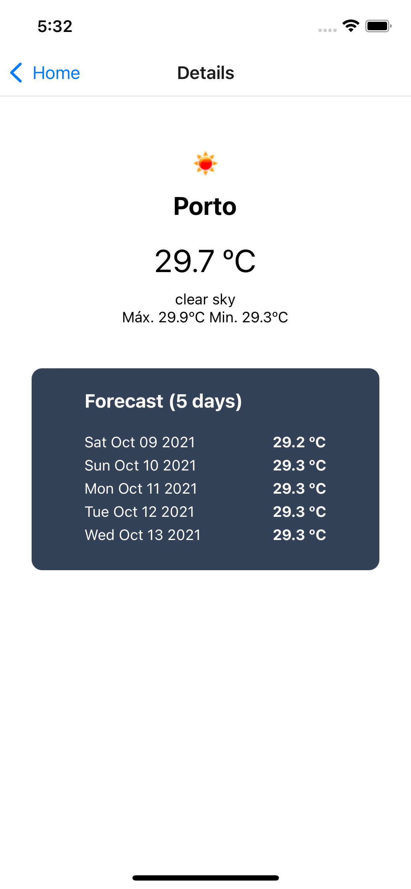
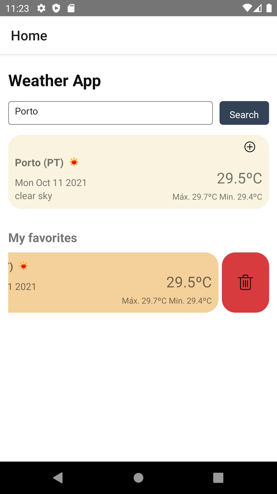

# Start Guide

## Features 🚀

1. **Default location (Lisbon)**

   When the user doesn't allow the app to use the current location (1), the API request is made with the default value - Lisbon, Portugal (2).

| Platform | 1                                                    | 2                                                     |
| -------- | ---------------------------------------------------- | ----------------------------------------------------- |
| iOS      |      |      |
| Android  |  |  |

2. **Get weather and forecast for the current location**

   The app shows a card with information about the location, country, actual temperature, date, description, max, min temperature for the day (1). If the user clicks on this card, the app navigates to Details screen (2) to show more information about forecast (5 days).

| Platform | 1                                                    | 2                                                     |
| -------- | ---------------------------------------------------- | ----------------------------------------------------- |
| iOS      |      |      |
| Android  |  |  |

3. **Get weather and forecast for a specific city**

   When the user clicks on the search button with a specific city, the app displays a card with information about the city, country, actual temperature, date, description, max/min temperature for the day. If the user clicks on this card, the app navigates to Details screen (2) to show more information about forecast (5 days).

| Platform | 1                                                    | 2                                                     |
| -------- | ---------------------------------------------------- | ----------------------------------------------------- |
| iOS      |      |      |
| Android  |  |  |

4. **Add and remove cities to favorite list**

   When the user clicks on the + icon on the right corner of the card (1), the card will be added to a favorite list below. The user also can remove the card doing the swipe left and clicks on the remove button (2).

| Platform | 1                                              | 2                                              |
| -------- | ------------------------------------------------ | ----------------------------------------------------- |
|    iOS      |  |  |
|      Android    |  |  |

5. **Persistent favorite city list**

   If the user adds cities to the favorite list and close the app, the information persists and if the user opens again, the info will be display successfully

---

## How to use [Open Weather Map API](https://openweathermap.org/api) ❓

Open Weather provides a collection of APIs to get weather data for any geographic coordinates.
In this project, I used the current weather and forecast (next 5 days) for the current user location but also for a specific city.

1. **Get weather and forecast data for the current location by coordinates**

   API call - weather

   > http://api.openweathermap.org/data/2.5/weather?lat={lat}&lon={lon}&appid={API key}

   API call - forecast

   > http://api.openweathermap.org/data/2.5/forecast?lat={lat}&lon={lon}&appid={API key}

2. **Get current weather and forecast data for a specific city**

   API call - weather

   > http://api.openweathermap.org/data/2.5/weather?q={city name}&appid={API key}

   API call - forecast

   > http://api.openweathermap.org/data/2.5/forecast?q={city name}&appid={API key}

Note 🚩

To make the API requests is mandatory to have an account on OpenWeather in order to have an API key registered.

---

## Assumptions 🔖

- Accordingly with OpenWeather API [subscriptions plans](https://openweathermap.org/price), with the free account is not possible to have access to forecast 10 days by city name. Taking this into account, I reduce the forecast information to 5 days, for current location and by city.

- If the app cannot fetch the user location, the default coordinates are Lisbon (Portugal):
  - latitude 38.71667
  - longitude -9.13333
